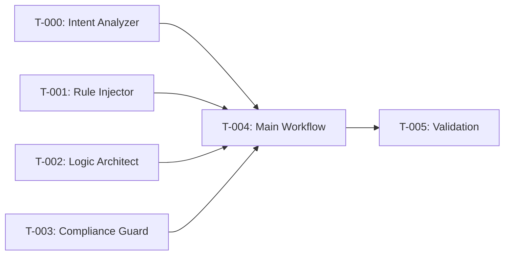

# Task Breakdown: Workflow Creation Workflow

**Source PRP**: `.agent/doc/prps/workflow-creation-workflow.md`
**Created**: 2025-12-25

---

## Task Overview

| Task ID | Task Name | Priority | Dependencies |
|---------|-----------|----------|--------------|
| T-000 | Create Intent Analyzer Agent | Critical | None |
| T-001 | Create Rule Injector Agent | Critical | T-000 |
| T-002 | Create Logic Architect Agent | Critical | T-001 |
| T-003 | Create Compliance Guard Agent | Critical | T-002 |
| T-004 | Create Main Workflow Orchestrator | Critical | T-000, T-001, T-002, T-003 |
| T-005 | Validation & Testing | High | T-004 |

---

## T-000: Create Intent Analyzer Agent

### Task Identification
- **Task ID**: T-000
- **Task Name**: Create Intent Analyzer Agent
- **Priority**: Critical (工作流第一步)

### Context & Background

**Task Purpose**:
- **As a** Workflow Creation Workflow
- **I need** an agent that understands user intent before any design work
- **So that** the workflow can accurately capture what the user wants to build

### Technical Requirements

**Functional Requirements (EARS format)**:
- **REQ-1**: When receiving user's raw request, the agent SHALL extract 5 elements (Name, Goal, I/O, Constraints, Success Criteria)
- **REQ-2**: Where any element is unclear, the agent SHALL ask clarifying questions
- **REQ-3**: The agent SHALL NOT proceed until all 5 elements are confirmed

### Files to Modify/Create
```
└── .agent/workflows/0-workflow_gen/intent-analyzer.md - [NEW] Agent persona
```

### Key Implementation Steps
1. **Step 1**: Create directory `.agent/workflows/0-workflow_gen/`
2. **Step 2**: Create `intent-analyzer.md` with agent persona
3. **Step 3**: Include 5-element extraction checklist
4. **Step 4**: Include clarification question mechanism

### Acceptance Criteria

```gherkin
Scenario 1: Complete intent extraction
  Given a user request "Create a code review workflow"
  When intent-analyzer processes the request
  Then it extracts: Name="代码审查工作流", Goal="自动化代码审查"
  And it outputs Input/Output, Constraints, Success Criteria

Scenario 2: Ambiguous request handling
  Given a vague request "Make a workflow"
  When intent-analyzer processes the request
  Then it generates clarifying questions
  And it pauses for user response
```

### Validation Commands
```bash
# Check file exists
test -f .agent/workflows/0-workflow_gen/intent-analyzer.md && echo "✅ PASS" || echo "❌ FAIL"

# Check file has required sections
grep -q "5 个要素" .agent/workflows/0-workflow_gen/intent-analyzer.md && echo "✅ Has 5 elements" || echo "❌ Missing"
```

---

## T-001: Create Rule Injector Agent

### Task Identification
- **Task ID**: T-001
- **Task Name**: Create Rule Injector Agent
- **Priority**: Critical

### Context & Background

**Task Purpose**:
- **As a** Workflow Creation Workflow
- **I need** an agent that reads and QUOTES official rules
- **So that** generated workflows are grounded in reality, not hallucinations

### Technical Requirements

**Functional Requirements (EARS format)**:
- **REQ-1**: The agent SHALL read `rules-and-workflows.md` and `v5.md`
- **REQ-2**: The agent SHALL output quotes with "原文:" format and line numbers
- **REQ-3**: The agent SHALL extract a list of known tools from system context
- **REQ-4**: The agent SHALL REJECT if no quotes are included

### Files to Modify/Create
```
└── .agent/workflows/0-workflow_gen/rule-injector.md - [NEW] Agent persona
```

### Key Implementation Steps
1. **Step 1**: Create `rule-injector.md`
2. **Step 2**: Include mandatory quote format: `> 原文: "..." (来源: file L##)`
3. **Step 3**: Include known tools list extraction
4. **Step 4**: Include GATE for rejection

### Acceptance Criteria

```gherkin
Scenario 1: Successful rule extraction
  Given rule-injector is invoked
  When it reads official rule files
  Then output contains at least 2 "原文:" quotes
  And output contains "已知工具列表"

Scenario 2: Missing quotes rejection
  Given rule-injector output
  When output does not contain "原文:" format
  Then GATE rejects with specific error message
```

### Validation Commands
```bash
# Check file exists
test -f .agent/workflows/0-workflow_gen/rule-injector.md && echo "✅ PASS" || echo "❌ FAIL"

# Check file has quote instruction
grep -q "原文:" .agent/workflows/0-workflow_gen/rule-injector.md && echo "✅ Has quote format" || echo "❌ Missing"
```

---

## T-002: Create Logic Architect Agent

### Task Identification
- **Task ID**: T-002
- **Task Name**: Create Logic Architect Agent
- **Priority**: Critical

### Context & Background

**Task Purpose**:
- **As a** Workflow Creation Workflow
- **I need** an agent that validates workflow logic (no dead ends, no infinite loops)
- **So that** generated workflows are structurally sound

### Technical Requirements

**Functional Requirements (EARS format)**:
- **REQ-1**: The agent SHALL answer 6 mandatory questions
- **REQ-2**: The agent SHALL detect redundant steps
- **REQ-3**: The agent SHALL detect ambiguous instructions
- **REQ-4**: The agent SHALL produce a Mermaid flowchart

### Files to Modify/Create
```
└── .agent/workflows/0-workflow_gen/logic-architect.md - [NEW] Agent persona
```

### Key Implementation Steps
1. **Step 1**: Create `logic-architect.md`
2. **Step 2**: Include 6 mandatory questions checklist
3. **Step 3**: Include redundancy detection logic
4. **Step 4**: Include Mermaid flowchart template

### Acceptance Criteria

```gherkin
Scenario 1: Complete logic analysis
  Given a workflow blueprint
  When logic-architect analyzes it
  Then all 6 questions are answered in a table
  And a Mermaid flowchart is generated

Scenario 2: Redundancy detected
  Given a workflow with 2 identical steps
  When logic-architect analyzes it
  Then it flags "发现冗余: [具体说明]"
```

### Validation Commands
```bash
# Check file exists
test -f .agent/workflows/0-workflow_gen/logic-architect.md && echo "✅ PASS" || echo "❌ FAIL"

# Check 6 questions
grep -q "6 个问题" .agent/workflows/0-workflow_gen/logic-architect.md && echo "✅ Has 6 questions" || echo "❌ Missing"
```

---

## T-003: Create Compliance Guard Agent

### Task Identification
- **Task ID**: T-003
- **Task Name**: Create Compliance Guard Agent
- **Priority**: Critical

### Context & Background

**Task Purpose**:
- **As a** Workflow Creation Workflow
- **I need** an agent that validates character limits and scores quality
- **So that** generated workflows comply with 12k limit and meet quality standards

### Technical Requirements

**Functional Requirements (EARS format)**:
- **REQ-1**: The agent SHALL run `wc -c` (or simulate) to check character count
- **REQ-2**: The agent SHALL REJECT if > 12,000 characters
- **REQ-3**: The agent SHALL score on 4 dimensions (10-point scale)
- **REQ-4**: If score < 7.0, the agent SHALL trigger iteration (max 3 rounds)

### Files to Modify/Create
```
└── .agent/workflows/0-workflow_gen/compliance-guard.md - [NEW] Agent persona
```

### Key Implementation Steps
1. **Step 1**: Create `compliance-guard.md`
2. **Step 2**: Include character count check with `wc -c`
3. **Step 3**: Include 4-dimension scoring rubric (规则遵守度 30%, 逻辑清晰度 25%, Prompt质量 25%, 字符效率 20%)
4. **Step 4**: Include iteration mechanism (max 3 rounds)

### Acceptance Criteria

```gherkin
Scenario 1: Character limit pass
  Given a workflow with 8,000 characters
  When compliance-guard validates
  Then character check shows "✅ PASS"

Scenario 2: Character limit fail
  Given a workflow with 15,000 characters
  When compliance-guard validates
  Then character check shows "❌ OVER LIMIT"
  And specific compression suggestions are provided

Scenario 3: Score iteration
  Given a workflow scoring 5.5/10
  When compliance-guard validates
  Then it triggers "返回 Phase 2 修改"
  And iteration count shows "轮次: 1/3"
```

### Validation Commands
```bash
# Check file exists
test -f .agent/workflows/0-workflow_gen/compliance-guard.md && echo "✅ PASS" || echo "❌ FAIL"

# Check scoring rubric
grep -q "评分维度" .agent/workflows/0-workflow_gen/compliance-guard.md && echo "✅ Has scoring" || echo "❌ Missing"
```

---

## T-004: Create Main Workflow Orchestrator

### Task Identification
- **Task ID**: T-004
- **Task Name**: Create Main Workflow Orchestrator
- **Priority**: Critical
- **Dependencies**: T-000, T-001, T-002, T-003

### Context & Background

**Task Purpose**:
- **As a** User
- **I need** a main workflow file `/0-workflow_gen`
- **So that** I can invoke the workflow creation system with a single command

### Technical Requirements

**Functional Requirements (EARS format)**:
- **REQ-1**: The workflow SHALL have 5 phases (Phase -1 to Phase 3)
- **REQ-2**: Each phase SHALL have a CHECKPOINT
- **REQ-3**: The workflow SHALL have YAML frontmatter with description and argument-hint
- **REQ-4**: The workflow SHALL be < 12,000 characters

### Files to Modify/Create
```
└── .agent/workflows/0-workflow_gen.md - [NEW] Main workflow
```

### Key Implementation Steps
1. **Step 1**: Create YAML frontmatter
2. **Step 2**: Create Agent Roster table
3. **Step 3**: Define Phase -1 (Intent Understanding) with CHECKPOINT
4. **Step 4**: Define Phase 0 (Rule Injection) with CHECKPOINT
5. **Step 5**: Define Phase 1 (Logic Architecture) with CHECKPOINT
6. **Step 6**: Define Phase 2 (Content Writing) with CHECKPOINT
7. **Step 7**: Define Phase 3 (Compliance Validation) with iteration loop
8. **Step 8**: Verify total < 12,000 chars

### Acceptance Criteria

```gherkin
Scenario 1: Workflow structure valid
  Given the main workflow file
  When checked with linter
  Then YAML frontmatter is valid
  And all 5 phases are present
  And all CHECKPOINTs are present

Scenario 2: Character limit
  Given the main workflow file
  When wc -c is run
  Then result is < 12,000
```

### Validation Commands
```bash
# Check file exists
test -f .agent/workflows/0-workflow_gen.md && echo "✅ PASS" || echo "❌ FAIL"

# Check character count
chars=$(wc -c < .agent/workflows/0-workflow_gen.md)
if [ "$chars" -lt 12000 ]; then echo "✅ $chars chars (< 12000)"; else echo "❌ $chars chars (OVER LIMIT)"; fi

# Check YAML frontmatter
head -1 .agent/workflows/0-workflow_gen.md | grep -q "^---" && echo "✅ Has frontmatter" || echo "❌ Missing frontmatter"
```

---

## T-005: Validation & Testing

### Task Identification
- **Task ID**: T-005
- **Task Name**: Validation & Testing
- **Priority**: High
- **Dependencies**: T-004

### Context & Background

**Task Purpose**:
- **As a** Developer
- **I need** to verify the workflow works end-to-end
- **So that** users can rely on it for creating new workflows

### Key Implementation Steps
1. **Step 1**: Run all validation commands from T-000 to T-004
2. **Step 2**: Test with a sample request: "Create a code review workflow"
3. **Step 3**: Verify each CHECKPOINT pauses correctly
4. **Step 4**: Verify final output is a valid workflow file

### Validation Commands
```bash
# Run all file existence checks
for f in intent-analyzer.md rule-injector.md logic-architect.md compliance-guard.md; do
  test -f .agent/workflows/0-workflow_gen/$f && echo "✅ $f" || echo "❌ $f"
done

# Check main workflow
test -f .agent/workflows/0-workflow_gen.md && echo "✅ Main workflow" || echo "❌ Main workflow"

# Character count
wc -c .agent/workflows/0-workflow_gen.md
```

---

## Dependency Graph



---

## Estimated Effort

| Task | Complexity | Estimated Time |
|------|------------|----------------|
| T-000 | Medium | 15 min |
| T-001 | Medium | 15 min |
| T-002 | High | 20 min |
| T-003 | High | 20 min |
| T-004 | High | 30 min |
| T-005 | Low | 10 min |
| **Total** | | **~110 min** |
