# Agent Skills 深度研究报告

## 概述

本报告基于以下官方文档的深度阅读：
- [Antigravity Skills 官方文档](https://antigravity.google/docs/skills)
- [Agent Skills 官网 - 概述](https://agentskills.io/home)
- [Agent Skills 官网 - 什么是 Skills](https://agentskills.io/what-are-skills)
- [Agent Skills 官网 - 规格说明](https://agentskills.io/specification)
- [Agent Skills 官网 - 集成指南](https://agentskills.io/integrate-skills)
- [Anthropic Skills GitHub 仓库](https://github.com/anthropics/skills)

---

## 第一部分：Agent Skills 核心概念

### 1.1 什么是 Agent Skills？

**Agent Skills** 是一种**轻量级、开放格式**，用于扩展 AI Agent 的能力，赋予其专业知识和工作流。

> **官方定义**：A simple, open format for giving agents new capabilities and expertise.
>（一种简单、开放的格式，用于赋予 Agent 新的能力和专业知识。）

### 1.2 Skills 的本质

Skills 不仅仅是简单的指令集，而是结合了以下要素的**复合体**：
- **领域知识 (Domain Expertise)**：专业领域的知识库
- **操作流程 (Workflows)**：可重复执行的工作流程
- **可选执行脚本 (Scripts)**：辅助脚本和工具

### 1.2.1 SKILL.md 的三大核心特性

根据官方文档，SKILL.md 文件具有以下三大核心特性：

| 特性 | 英文 | 说明 |
|:---|:---|:---|
| **自文档化** | Self-documenting | 技能作者或用户可以通过阅读 SKILL.md 理解其功能，便于审计和改进 |
| **可扩展** | Extensible | 技能可以从简单的文本指令扩展到可执行代码、资产和模板 |
| **可移植** | Portable | 技能只是文件，因此易于编辑、版本控制和分享 |

### 1.3 Skills 能实现什么？

根据官方文档，Skills 可以实现以下功能：

| 功能类型 | 描述 | 示例 |
|:---|:---|:---|
| **领域专业知识** | 将专业知识打包成可复用的指令 | 法律审查流程、数据分析管道 |
| **新能力** | 赋予 Agent 全新的能力 | 创建演示文稿、构建 MCP 服务器、分析数据集 |
| **可重复工作流** | 将多步骤任务转化为一致、可审计的工作流 | 代码审查流程、文档生成流程 |
| **跨平台互操作** | 在不同兼容 Skills 的 Agent 产品间复用同一技能 | 同一技能可用于 Claude Code、Antigravity 等 |

### 1.4 开放开发

Agent Skills 是由 **Anthropic** 主导的开放格式，可在 GitHub 上查看：
- 规范仓库：https://github.com/agentskills/agentskills
- 示例技能：https://github.com/anthropics/skills
- 参考库：https://github.com/agentskills/agentskills/tree/main/skills-ref

### 1.5 自由度控制 (Degrees of Freedom)

根据任务的易错性与标准化程度，官方定义了三种 Skill 实现的自由度级别：

| 级别 | 适用场景 | 实现方式 | 示例 |
|:---|:---|:---|:---|
| **High Freedom** (高自由度) | 创意任务、探索性任务，有多种有效路径 | **纯文本指令** | 网页设计、创意写作、头脑风暴 |
| **Medium Freedom** (中自由度) | 有最佳实践模式，但需一定灵活性的任务 | **伪代码 / 模板** | 代码审查、Commit 消息生成 |
| **Low Freedom** (低自由度) | 易错、必须 100% 准确、确定性的任务 | **Scripts (Python/Bash)** | PDF 旋转、格式转换、数学计算 |

---

## 第二部分：Skills 的工作原理

### 2.1 三阶段工作流程

Skills 的工作遵循三个阶段：

```mermaid
flowchart LR
    A[发现 Discovery] --> B[激活 Activation] --> C[执行 Execution]
```



| 阶段 | 描述 |
|:---|:---|
| **1. 发现 (Discovery)** | 启动时，Agent 仅加载每个可用技能的 `name` 和 `description`，用于识别何时可能相关 |
| **2. 激活 (Activation)** | 当任务与技能描述匹配时，Agent 将完整的 SKILL.md 指令读入上下文 |
| **3. 执行 (Execution)** | Agent 按照指令执行，根据需要加载引用文件或执行捆绑代码 |

### 2.2 渐进式披露 (Progressive Disclosure)

Skills 采用渐进式加载策略，以优化 Token 使用：

| 加载级别 | Token 预算 | 加载时机 | 内容 |
|:---|:---|:---|:---|
| **元数据** | ~100 tokens | 启动时加载所有技能 | `name` 和 `description` 字段 |
| **指令** | <500 行 (硬性限制) | 技能激活时加载 | 完整的 SKILL.md 正文 (超过 500 行必须拆分) |
| **资源** | 按需加载 | 需要时加载 | `scripts/`、`references/`、`assets/` 中的文件 |

> [!IMPORTANT]
> **行数限制**：SKILL.md 正文必须控制在 **500 行以内**，超过必须拆分到 `references/`。这是硬性限制。

---

## 第三部分：目录结构与文件规范

### 3.1 基本目录结构

最小化的 Skill 只需要一个文件：

```text
skill-name/
└── SKILL.md    # 必需：指令 + 元数据
```

### 3.2 完整目录结构

复杂的 Skill 可以包含可选目录：

```text
my-skill/
├── SKILL.md        # 必需：核心定义文件，包含 Frontmatter 和指令
├── scripts/        # 可选：可执行代码
├── references/     # 可选：文档和参考资料
└── assets/         # 可选：模板和资源
```

### 3.3 可选目录详解

#### scripts/ 目录

用于存放该技能专用的可执行脚本或工具。脚本应该：
- 自包含或清楚记录依赖
- 包含有帮助的错误消息
- 优雅地处理边缘情况

#### references/ 目录

用于存放详细的技术参考文档，例如：
- `REFERENCE.md` - 详细技术参考
- `FORMS.md` - 表单模板或结构化数据格式
- 领域特定文件（如 `finance.md`、`legal.md` 等）

#### assets/ 目录

用于存放模板和资源文件：
- 模板（文档模板、配置模板）
- 图像（图表、示例）
- 数据文件（查找表、模式）

---

### 3.4 禁止文件清单 (Denylist) 🚨

Skill 是给 **Agent** 阅读的，不是给 **人类** 阅读的。为了节省 Token，以下文件**严禁**包含在 Skill 目录中：

- ❌ `README.md` (说明书是给人的，Agent 读 SKILL.md)
- ❌ `INSTALLATION.md` / `INSTALLATION_GUIDE.md`
- ❌ `CHANGELOG.md`
- ❌ `QUICK_REFERENCE.md`

> **原则**：任何非 Agent 消费的文件都是 Token 的浪费。

---

## 第四部分：SKILL.md 文件格式规范

### 4.1 文件结构概述

SKILL.md 文件由两部分组成：
1. **YAML Frontmatter**（必需）：元数据定义
2. **Markdown Body**：详细指令

### 4.2 Frontmatter 格式

Frontmatter 必须以 `---` 包围：

```yaml
---
name: skill-name
description: A description of what this skill does and when to use it.
---
```

### 4.3 Frontmatter 字段详解

#### 必填字段

| 字段 | 必填 | 格式要求 | 描述 |
|:---|:---|:---|:---|
| **`name`** | ✅ 是 | slug-style | 技能的唯一标识符 |
| **`description`** | ✅ 是 | 1-1024 字符 | 描述技能的用途和使用时机 |

#### 可选字段

| 字段 | 必填 | 格式要求 | 描述 |
|:---|:---|:---|:---|
| **`license`** | ❌ 否 | 字符串 | 技能的许可证 |
| **`compatibility`** | ❌ 否 | 1-500 字符 | 环境要求 |
| **`metadata`** | ❌ 否 | 键值对 | 额外属性 |
| **`allowed-tools`** | ❌ 否 | 空格分隔列表 | 预批准的工具列表（实验性） |

---

### 4.4 `name` 字段规则

**格式要求**：
- 必须是 1-64 个字符
- 只能包含 Unicode 小写字母数字字符和连字符（`a-z` 和 `-`）
- 不能以 `-` 开头或结尾
- 不能包含连续连字符（`--`）
- 必须与父目录名称匹配

**正确示例**：
```yaml
name: pdf-processing
name: data-analysis
name: code-review
```

**错误示例**：
```yaml
name: PDF-Processing   # ❌ 不允许大写
name: -pdf             # ❌ 不能以连字符开头
name: pdf--processing  # ❌ 不允许连续连字符
```

---

### 4.5 `description` 字段规则

**格式要求**：
- 必须是 1-1024 个字符
- 应描述技能的功能**和**使用时机
- 应包含帮助 Agent 识别相关任务的特定关键词

**正确示例**：
```yaml
description: Extracts text and tables from PDF files, fills PDF forms, and merges multiple PDFs. Use when working with PDF documents or when the user mentions PDFs, forms, or document extraction.
```

**错误示例**：
```yaml
description: Helps with PDFs.  # ❌ 太简略，缺乏关键词
```

> [!TIP]
> **精准描述的重要性**：`description` 是 Agent 进行语义匹配的关键依据，决定何时加载该技能。描述应该像 API 文档一样准确。

---

### 4.6 `license` 字段规则

**格式要求**：
- 指定应用于技能的许可证
- 建议简短（许可证名称或捆绑许可证文件的名称）

**示例**：
```yaml
license: Apache-2.0
license: Proprietary. LICENSE.txt has complete terms
```

---

### 4.7 `compatibility` 字段规则

**格式要求**：
- 如果提供，必须是 1-500 个字符
- 仅在技能有特定环境要求时才应包含
- 可以指示预期产品、所需系统包、网络访问需求等

**示例**：
```yaml
compatibility: Designed for Claude Code (or similar products)
compatibility: Requires git, docker, jq, and access to the internet
```

---

### 4.8 `metadata` 字段规则

**格式要求**：
- 从字符串键到字符串值的映射
- 客户端可以使用此字段存储 Agent Skills 规范未定义的额外属性
- 建议使键名具有合理的唯一性以避免意外冲突

**示例**：
```yaml
metadata:
  author: example-org
  version: "1.0"
```

---

### 4.9 `allowed-tools` 字段规则

**格式要求**：
- 预批准运行的工具的空格分隔列表
- **实验性**：不同 Agent 实现对此字段的支持可能有所不同

**示例**：
```yaml
allowed-tools: Bash(git:*) Bash(jq:*) Read
```

---

### 4.10 Body Content（正文内容）

Frontmatter 之后的 Markdown 部分是给 Agent 的**操作指南**，应包含：

- **分步骤指令**：清晰的执行步骤
- **输入输出示例**：帮助 Agent 理解预期
- **常见边缘情况**：处理异常情况的指导
- **角色/期望 (Role/Expectation)**：定义 Agent 执行此技能时的角色
- **检查清单 (Checklist)**：分步骤的检查项
- **协议 (Protocols)**：反馈格式（如"始终使用 JSON 返回结果"）
- **知识库 (Knowledge Base)**：相关的特定领域知识

---

## 第五部分：完整 SKILL.md 示例

### 5.1 简单示例

```markdown
---
name: pdf-processing
description: Extract text and tables from PDF files, fill forms, merge documents.
---

# PDF Processing

## When to use this skill

Use this skill when the user needs to work with PDF files...

## How to extract text

1. Use pdfplumber for text extraction...

## How to fill forms

...
```

### 5.2 带可选字段的完整示例

```markdown
---
name: pdf-processing
description: Extract text and tables from PDF files, fill forms, merge documents.
license: Apache-2.0
metadata:
  author: example-org
  version: "1.0"
---

# PDF Processing

## When to use this skill

Use this skill when the user needs to work with PDF files...

## How to extract text

1. Use pdfplumber for text extraction...

## How to fill forms

...
```

### 5.3 代码审查技能示例

```markdown
---
name: code-review
description: 审查代码变更中的 Bug、风格问题及最佳实践。在处理 PR 或检查代码质量时使用。
---

# Code Review Skill

当你执行代码审查时，请严格遵守以下步骤：

## 1. 审查检查清单

- **正确性**：代码是否实现了预期功能？
- **边界情况**：是否处理了错误条件和异常？
- **风格**：是否符合项目的命名和结构规范？
- **性能**：是否存在明显的效率低下或资源泄露？

## 2. 如何提供反馈

- 必须指出具体的改进代码行。
- 解释"为什么要改"，而不仅仅是"怎么改"。
- 如果可能，通过 Artifacts 提供重构后的代码示例。
```

---

## 第六部分：Antigravity Skills 特定规则

### 6.1 存储位置

Antigravity Agent 会在以下特定路径自动搜索技能文件：

| 类型 | 路径 | 作用范围 |
|:---|:---|:---|
| **项目级技能** | `<workspace-root>/.agent/skills/` | 仅对当前项目生效 |
| **全局技能** | `~/.gemini/antigravity/skills/` | 在不同项目间复用 |

### 6.2 文件命名

Antigravity 支持两种形式：

| 形式 | 文件名 | 描述 |
|:---|:---|:---|
| **单文件模式** | `skill-name.md` | 简单技能 |
| **目录模式** | `skill-name/skill.md` 或 `skill-name/SKILL.md` | 复杂技能 |

### 6.3 触发机制

基于**语义匹配**：Agent 会动态扫描可用技能的描述信息，将其与当前用户任务进行匹配，并在需要时自主"激活"。

---

## 第七部分：文件引用规则

### 7.1 引用语法

在 SKILL.md 中引用其他文件时，请使用官方推荐的标准化语法，这能更好地触发 Agent 的工具调用：

```markdown
See [the reference guide](references/REFERENCE.md) for details.
Refer to [schema definition](references/schema.json) for data structure.
```

🚫 **避免**：
- 不要直接粘贴大段文本。
- 不要使用含糊的描述（如 "check the files"）。


### 7.2 引用行为

- 引用的文件**不会**在技能激活时自动加载
- 只有当 Agent 在执行过程中需要时才会按需加载
- 这是渐进式披露策略的一部分

---

## 第八部分：集成指南

### 8.1 集成方法概述

集成 Skills 支持到你的 Agent 需要以下步骤：

1. **发现技能**：在配置的目录中发现技能
2. **加载元数据**：启动时加载元数据（`name` 和 `description`）
3. **匹配任务**：将用户任务与相关技能匹配
4. **激活技能**：通过加载完整指令激活技能
5. **执行资源**：根据需要执行脚本和访问资源

### 8.2 技能发现

搜索配置目录中包含 `SKILL.md` 文件的文件夹。

### 8.3 解析 Frontmatter

伪代码示例：

```python
function parseMetadata(skillPath):
    content = readFile(skillPath + "/SKILL.md")
    frontmatter = extractYAMLFrontmatter(content)
    return {
        name: frontmatter.name,
        description: frontmatter.description,
        path: skillPath
    }
```

### 8.4 注入上下文

将技能元数据以 XML 格式注入 Agent 上下文：

```xml
<available_skills>
  <skill>
    <name>pdf-processing</name>
    <description>Extracts text and tables from PDF files, fills forms, merges documents.</description>
    <location>/path/to/skills/pdf-processing/SKILL.md</location>
  </skill>
  <skill>
    <name>data-analysis</name>
    <description>Analyzes datasets, generates charts, and creates summary reports.</description>
    <location>/path/to/skills/data-analysis/SKILL.md</location>
  </skill>
</available_skills>
```

> [!NOTE]
> `location` 字段用于告诉 Agent 在何处找到完整的技能定义。

---

## 第九部分：安全考量

### 9.1 安全最佳实践

在集成 Skills 时，应考虑以下安全措施：

| 措施 | 描述 |
|:---|:---|
| **沙箱化 (Sandboxing)** | 在隔离环境中运行脚本 |
| **允许列表 (Allowlisting)** | 仅执行来自受信任技能的脚本 |
| **确认 (Confirmation)** | 在运行潜在危险操作前询问用户 |
| **日志记录 (Logging)** | 记录所有脚本执行以供审计 |

---

## 第十部分：验证工具

### 10.1 skills-ref 参考库

官方提供了 `skills-ref` 工具用于验证技能和生成提示 XML：

**验证技能**：
```bash
skills-ref validate ./my-skill
```

**生成提示 XML**：
```bash
skills-ref to-prompt <path>...
```

生成 `<available_skills>` 格式的 XML 输出。

---

## 第十一部分：最佳实践

### 11.1 制作高质量 Skill 的建议

| 实践 | 描述 |
|:---|:---|
| **黑盒脚本化** | 如果技能包含脚本，在 Markdown 中指导 Agent 使用 `--help` 来获取脚本用法，而不是让其阅读脚本源代码。这能显著减少 Token 消耗 |
| **包含决策树** | 对于复杂逻辑，明确"如果是 A 情况，采取 X 方案；如果是 B 情况，采取 Y 方案" |
| **精准的触发描述** | `description` 应该像 API 文档一样准确 |
| **模块化思维** | 宁可制作多个专注的小技能（单一职责），也不要制作一个全能但混乱的巨型技能 |

### 11.2 描述字段最佳实践

```yaml
# ✅ 好的描述
description: 用于在提交 PR 前按照 Google Java Style 指南检查代码风格

# ❌ 差的描述
description: 检查代码
```

### 11.3 Token 优化

- SKILL.md 正文控制在 **< 500 行** (硬性限制)
- 详细参考资料放在 `references/` 目录，按需加载
- 脚本说明使用 `--help` 而非完整源码

### 11.4 官方最佳实践指南

Anthropic 官方提供了详细的 Skill 编写最佳实践文档：

- **官方最佳实践**：https://platform.claude.com/docs/en/agents-and-tools/agent-skills/best-practices

该文档详细说明了：
- 如何编写有效的 `description` 字段
- 如何结构化 SKILL.md 正文
- 如何处理边界情况
- 如何优化 Token 使用

---

## 第十二部分：平台支持

### 12.1 Claude Code

在 Claude Code 中安装技能：

```bash
# 添加 marketplace
/plugin marketplace add anthropics/skills

# 安装特定技能
/plugin install document-skills@anthropic-agent-skills
/plugin install example-skills@anthropic-agent-skills
```

### 12.2 Claude.ai

付费用户可直接使用示例技能，或按照官方文档上传自定义技能。

### 12.3 Claude API

通过 Claude API 使用 Anthropic 预构建的技能或上传自定义技能。

### 12.4 Antigravity

将技能放置在：
- 项目级：`<workspace-root>/.agent/skills/`
- 全局级：`~/.gemini/antigravity/skills/`

---

## 第十三部分：官方资源汇总

| 资源 | 链接 |
|:---|:---|
| Agent Skills 官网 | https://agentskills.io/ |
| 规范仓库 | https://github.com/agentskills/agentskills |
| 示例技能 | https://github.com/anthropics/skills |
| 参考库 | https://github.com/agentskills/agentskills/tree/main/skills-ref |
| Antigravity 文档 | https://antigravity.google/docs/skills |
| Claude 技能支持文档 | https://support.claude.com/en/articles/12512176-what-are-skills |
| 创建自定义技能 | https://support.claude.com/en/articles/12512198-creating-custom-skills |
| 编写最佳实践 | https://platform.claude.com/docs/en/agents-and-tools/agent-skills/best-practices |

---

## 总结

Agent Skills 是一个轻量级、开放的格式，核心在于**结构化的引导**：

1. **文件格式**：SKILL.md 使用 YAML Frontmatter + Markdown Body
2. **必填字段**：`name`（1-64 字符，小写 + 连字符）和 `description`（1-1024 字符）
3. **目录结构**：最小化只需 SKILL.md，复杂技能可包含 `scripts/`、`references/`、`assets/`
4. **工作流程**：发现 → 激活 → 执行，采用渐进式加载优化 Token
5. **最佳实践**：精准描述、模块化设计、控制 Token 预算

制作重点不在于编写复杂的逻辑代码，而在于利用 **YAML 元数据进行精准分发**，以及利用 **Markdown 指令建立逻辑严密的执行链路**。
