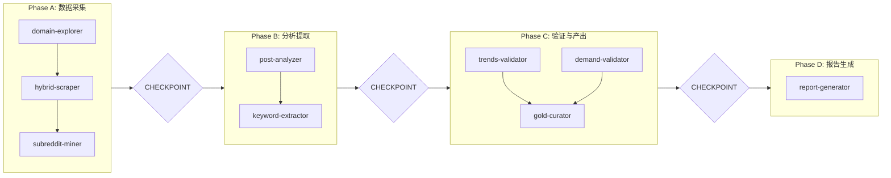

# Pain Miner Orchestrator

协调 8 个专属 Agent 完成痛点挖掘流程。

> **架构**: 多 Agent 协调系统
> **版本**: 10.0.0 (参见 [VERSION](pain-miner/VERSION) | [CHANGELOG](pain-miner/CHANGELOG.md))
> **核心改进** (v10.0):
> - 🔄 **循环控制**: 显式目标清单 + 进度计数
> - 🧠 **CoT 推理**: Filter/Insight Prompt 强制思考步骤
> - 🔧 **错误恢复**: retry_count + failed 状态

---

## 🔧 MCP 工具约定

> [!IMPORTANT]
> **所有数据库操作必须使用 MCP sqlite 工具，禁止使用命令行 `sqlite3`**

| 操作类型 | MCP 工具 | 示例 |
|:--|:--|:--|
| 查询 (SELECT) | `mcp_sqlite_read_query` | 读取数据 |
| 写入 (INSERT/UPDATE/DELETE) | `mcp_sqlite_write_query` | 修改数据 |
| 表结构 | `mcp_sqlite_list_tables` / `mcp_sqlite_describe_table` | 查看 Schema |

---

## 🚫 语言强约束 (Language Protocol - MANDATORY)

> [!CAUTION]
> **违反语言协议，整个执行无效**

| 场景 | 语言 | 示例 |
|:--|:--|:--|
| 执行报告 (标题/描述/建议) | **中文** | "领域探索完成，发现 5 个新社区" |
| 数据库字段值 | 英文 | `status: verified`, `lead_type: founder` |
| Gate 输出 | 中文标签 + 英文值 | `数据类型: Subreddits, Agent 上报: 5` |

**检查方法**: 报告生成前，扫描是否包含连续 10+ 英文单词的句子 (排除代码块)。如有，必须翻译为中文。

---

## Agent 清单

| Agent | 职责 | 文件 | v8.0 变更 |
|-------|------|------|----------|
| domain-explorer | 领域探索、Subreddit 发现 | [domain-explorer.md](pain-miner/domain-explorer.md) | - |
| **hybrid-scraper** | **混合采集 (API+Browser)** | [hybrid-scraper.md](pain-miner/hybrid-scraper.md) | **[NEW]** |
| subreddit-miner | 社区深挖、帖子收集 | [subreddit-miner.md](pain-miner/subreddit-miner.md) | 调用 hybrid-scraper |
| post-analyzer | 帖子分析、痛点提取 | [post-analyzer.md](pain-miner/post-analyzer.md) | **双层 Prompt** |
| keyword-extractor | 关键词提取、SEO 策略 | [keyword-extractor.md](pain-miner/keyword-extractor.md) | - |
| trends-validator | Google Trends 验证 | [trends-validator.md](pain-miner/trends-validator.md) | - |
| demand-validator | Upwork 付费需求验证 | [demand-validator.md](pain-miner/demand-validator.md) | - |
| gold-curator | 最终验证、金矿管理 | [gold-curator.md](pain-miner/gold-curator.md) | **生成 Action Plan** |
| report-generator | 报告生成与验证 | [report-generator.md](pain-miner/report-generator.md) | - |

---

## 数据文件

| 文件 | 路径 |
|------|------|
| 数据库 | `pain-miner-dashboard/pain-miner.db` |
| 报告 | `pain-miner-dashboard/docs/reports/` |

---

## Schema 版本管理 (v10.0 新增)

> [!IMPORTANT]
> **Schema Migration 已从工作流分离**。DDL 语句位于 `migrations/v10_schema.sql`。

执行工作流前，请确保已运行最新的 Migration:
```bash
sqlite3 pain-miner-dashboard/pain-miner.db < pain-miner-dashboard/migrations/v10_schema.sql
```

---

## 执行 SLA

> ⛔ **MANDATORY**: 每个 Agent 必须达成最低标准。

| Agent | 最低执行标准 |
|-------|------------|
| Domain Explorer | 至少搜索 2 个抱怨词 |
| **Hybrid Scraper** | API 成功率 > 70% (否则自动切 Browser) |
| Subreddit Miner | 处理所有 new Subreddit (显式目标清单) |
| Post Analyzer | MIN(5, 未分析总数) |
| Keyword Extractor | 提取 2+ 竞品词 |
| Trends Validator | 处理所有 new/pending 关键词 |
| Demand Validator | 处理所有 trends_validated 关键词 |
| Gold Curator | 处理所有 verified 关键词，**生成 action_plan** |

---

## 执行流程\n
### Step 0: Schema 版本检查 (v10.0 新增)

**工具**: `mcp_sqlite_read_query`

```sql
SELECT version FROM schema_migrations ORDER BY id DESC LIMIT 1;
```

**GATE**:
```
🔍 SCHEMA_CHECK_GATE:
  - 期望版本: >= 10.0.0
  - 实际版本: {version}
  - VERDICT: {PASS / FAIL}
```

| 结果 | 行动 |
|:--|:--|
| 返回 `10.0.0` 或更高 | ✅ 继续 Step 1 |
| 返回空或表不存在 | ⛔ HALT - 提示运行 Migration |
| 返回低于 `10.0.0` | ⚠️ WARNING - 建议升级 |

---

### Step 1: 检查数据库状态

**工具**: 使用 `mcp_sqlite_read_query` 执行以下 SQL:

```sql
SELECT status, COUNT(*) FROM subreddits GROUP BY status;
SELECT status, COUNT(*) FROM keywords GROUP BY status;
SELECT COUNT(*) FROM leads WHERE analyzed = 0;
SELECT COUNT(*) FROM gold_leads;
```

> [!CAUTION]
> **禁止使用**: `run_command` + `sqlite3` 命令行

输出:
```markdown
📊 **DB Status**:
- Subreddits: X new / Y verified
- Keywords: X new / Y verified
- Leads: X unanalyzed
- Gold Leads: X total
```

### Step 2: 执行 Agent 流水线 (分阶段)

> [!IMPORTANT]
> **分阶段执行**: 每个 Phase 结束后必须通过 `notify_user` 工具汇报进度，等待用户确认后再继续。



---

#### Phase A: 数据采集

**包含 Agent**:
1. **Domain Explorer** - 执行 Step 1-6
2. **Hybrid Scraper** - 初始化采集引擎 (API 优先)
3. **Subreddit Miner** - 执行 Step 1-6，调用 Hybrid Scraper

> [!CAUTION]
> **MANDATORY_CHECKPOINT_A**:
> Phase A 完成后，必须调用 `notify_user` 汇报:
> 1. 新发现的 Subreddit 数量
> 2. 采集的帖子数量
> 3. 是否有失败的 Agent (及原因)
>
> 用户回复"继续"后才能进入 Phase B

---

#### Phase B: 分析提取

**包含 Agent**:
4. **Post Analyzer** - 执行 Step 1-5，使用双层 Prompt，输出 TOP 5 痛点
5. **Keyword Extractor** - 执行 Step 1-4

> [!CAUTION]
> **MANDATORY_CHECKPOINT_B**:
> Phase B 完成后，必须调用 `notify_user` 汇报:
> 1. 分析的帖子数量
> 2. 高价值痛点数量
> 3. 提取的关键词数量
>
> 用户回复"继续"后才能进入 Phase C

---

#### Phase C: 验证与产出

**包含 Agent**:
6. **Trends Validator** - 执行 Step 1-6
7. **Demand Validator** - 执行 Step 1-5
8. **Gold Curator** - 执行 Step 1-6，**生成 action_plan**

> [!CAUTION]
> **MANDATORY_CHECKPOINT_C**:
> Phase C 完成后，必须调用 `notify_user` 汇报:
> 1. 验证通过的关键词数量
> 2. 新生成的 Gold Leads 数量
> 3. Action Plan 概要
>
> 用户回复"继续"后才能进入 Phase D

---

#### Phase D: 报告生成

**包含 Agent**:
9. **Report Generator** - 执行 Step 1-6

### Step 3: 生成报告

调用 `report-generator.md`：
- 验证数据一致性
- 验证 GATE 保留
- 生成最终报告

---

## 协调规则

> [!IMPORTANT]
> **单一职责**: Orchestrator 只负责调度，不执行任何具体的数据操作。

- ❌ 不直接写入数据库 (只读)
- ❌ 不执行 web 搜索
- ✅ 调用 Agent (执行其步骤)
- ✅ 汇总并输出结果

---

## 循环保护常量

| Agent | 常量 | 值 |
|-------|------|-----|
| Subreddit Miner | MAX_SUBREDDITS | 10 |
| Post Analyzer | MAX_LEADS | 20 |
| Keyword Extractor | MAX_KEYWORDS_PER_LEAD | 10 |
| Trends Validator | MAX_KEYWORDS | 15 |
| Gold Curator | MAX_GOLD_LEADS | 20 |

---

## 禁止词 Gate (v9.1 新增)

> ⛔ **MANDATORY**: 在最终报告生成前，必须执行禁止词检查。

**禁止词列表**:
- `simulated`, `demo`, `模拟`, `placeholder`, `TODO`
- `for efficiency`, `to save time`, `skipped for speed`

**BANNED_WORDS_GATE**:
```
🔍 BANNED_WORDS_GATE:
  - 扫描范围: 所有 Agent 输出 + 最终报告
  - 发现违规词: {列表或"无"}
  - VERDICT: {PASS / BLOCKED}
```

**如果 BLOCKED** → ❌ 禁止生成报告，必须修复后重试

---

**Version**: 9.1 | **Type**: Orchestrator | **Updated**: 2025-12-26
