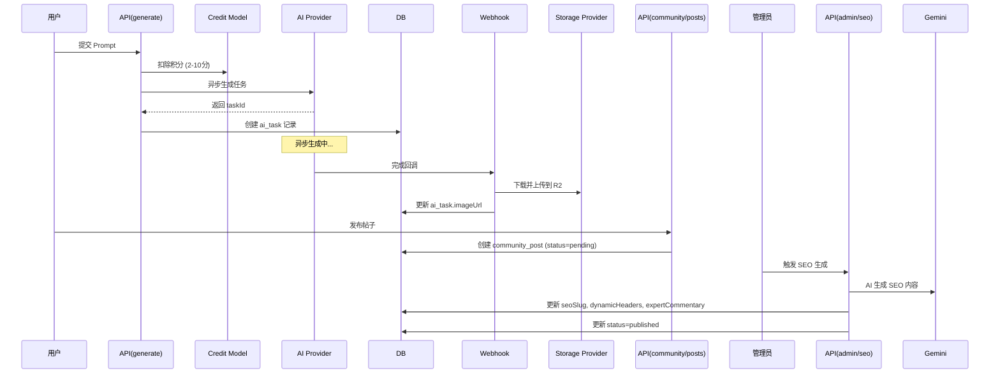

和我用中文交流
**AI 助手要求**: 强制使用 Claude Opus 4.5.5和Claude Haiku 4.5，禁止使用Claude Sonnet 4.5，用中文交流

# Nano Banana Ultra 项目开发指南

> **本文档面向 AI 编程助手 (Claude)，定义项目架构约束、开发规范和最佳实践**

---

## 🎯 项目概述

**Nano Banana Ultra** 是深度二开的 AI 提示词社区平台，专注于：

- **AI 图片/音乐生成**：多提供商支持 (Gemini/Replicate/Kie.ai)
- **V12.0 Case-Based RAG 优化**：基于向量搜索的智能提示词优化
- **社区画廊系统**：完整的创作发布、互动、SEO 优化流程
- **虚拟作者系统**：支持真实用户和虚拟作者混合内容生态
- **智能 SEO 生成**：AI 驱动的动态标题、专家点评、结构化数据

---

## 📋 技术栈

| 分类          | 技术                                                  |
| ------------- | ----------------------------------------------------- |
| **核心框架**  | Next.js 15.5 (App Router) + React 19.2 + TypeScript 5 |
| **数据库**    | PostgreSQL (Supabase) + Drizzle ORM 0.44              |
| **认证**      | Better-Auth 1.3                                       |
| **AI 提供商** | Gemini 3.0 Flash (gemini-3-flash-preview), Replicate, Kie.ai |
| **支付**      | Stripe, PayPal, Creem                                 |
| **存储**      | Cloudflare R2 (S3 兼容)                               |
| **向量搜索**  | Gemini Embedding API (text-embedding-004)             |
| **限流缓存**  | Cloudflare KV                                         |
| **部署**      | **Cloudflare Workers** (生产环境主要部署平台)         |
| **样式**      | Tailwind CSS 4 + Radix UI + Framer Motion             |

---

## 🏗️ 项目架构

### 核心目录结构

```
src/
├── app/                          # Next.js App Router
│   ├── [locale]/                 # 国际化路由层
│   │   ├── (admin)/              # 管理后台 (18 个页面)
│   │   ├── (auth)/               # 认证页面
│   │   ├── (chat)/               # 聊天功能
│   │   ├── (docs)/               # 文档系统
│   │   └── (landing)/            # 前台页面 (画廊/首页/定价等)
│   └── api/                      # API Routes (95 个端点)
│       ├── ai/                   # AI 生成、优化、查询
│       ├── admin/                # 管理后台 API
│       ├── community/            # 社区帖子、互动
│       ├── payment/              # 支付、回调
│       └── user/                 # 用户信息、积分
│
├── config/                       # 配置中心
│   └── db/schema.ts              # Drizzle Schema (28 张表)
│
├── core/                         # 核心模块 (不可修改)
│   ├── auth/                     # Better-Auth 配置
│   ├── db/                       # 数据库连接
│   ├── i18n/                     # 国际化
│   └── rbac/                     # 权限控制
│
├── extensions/                   # 可扩展模块
│   ├── ai/                       # AI Provider (Gemini/Replicate/Kie)
│   ├── payment/                  # 支付 Provider (Stripe/PayPal/Creem)
│   ├── storage/                  # 存储 Provider (R2/S3)
│   └── email/                    # 邮件 Provider (Resend)
│
└── shared/                       # 共享层
    ├── models/                   # 数据模型 (20 个，直接操作数据库)
    ├── services/                 # 业务服务 (18 个，聚合 models + extensions)
    ├── blocks/                   # 可复用 UI 组件块
    ├── components/               # 基础 UI 组件
    └── lib/                      # 工具函数库 (27 个工具)
```

### 架构分层原则

```
┌─────────────────────────────────────────────────────────┐
│  app/api/* (API Routes)  |  app/[locale]/* (Pages)      │  应用层
└────────────────┬────────────────────────────────────────┘
                 │ 调用
┌────────────────▼────────────────────────────────────────┐
│         shared/services/* (业务服务层)                   │  服务层
│  ai.ts | payment.ts | storage.ts | vector-search.ts    │
└────────┬────────────────────┬────────────────────────────┘
         │ 聚合                │ 调用
┌────────▼──────────┐  ┌─────▼──────────────────────────┐
│ shared/models/*   │  │ extensions/* (扩展层)           │  数据层
│ (数据模型)         │  │ AI/Payment/Storage Providers   │
└───────────────────┘  └────────────────────────────────┘
```

**关键约束**：

1. ✅ **API Routes 只能调用 Services**，禁止直接调用 Models 或 Providers
2. ✅ **Services 聚合 Models + Extensions**，提供统一业务接口
3. ✅ **Models 直接操作数据库**，不依赖 Services
4. ✅ **Extensions 封装外部服务**，通过 Provider 模式统一接口

---

## 🚫 严格禁止的开发模式

### ❌ 禁止 1：绕过 Provider 直接调用外部 API

```typescript
// ❌ 错误示例：在 API Route 中直接调用 Gemini
export async function POST(request: Request) {
  const response = await fetch('https://generativelanguage.googleapis.com/...', {
    headers: { 'x-goog-api-key': process.env.GEMINI_API_KEY }
  });
}

// ✅ 正确示例：通过 AIProvider 调用
import { getAIService } from '@/shared/services/ai';

export async function POST(request: Request) {
  const aiService = await getAIService();
  const provider = aiService.getProvider('gemini');
  const result = await provider.generate({ params: { ... } });
}
```

**原因**：

- 统一管理 API Key（从数据库 config 表读取，支持动态更新）
- 统一错误处理和日志记录
- 支持多提供商切换和降级策略

### ❌ 禁止 2：在 API Routes 中直接操作数据库

```typescript
// ❌ 错误示例：在 API 中直接查询数据库
import { db } from '@/core/db';
import { communityPost } from '@/config/db/schema';

export async function GET(request: Request) {
  const posts = await db.select().from(communityPost).where(...);
  return respData(posts);
}

// ✅ 正确示例：通过 Model 封装数据库操作
import { getCommunityPosts } from '@/shared/models/community_post';

export async function GET(request: Request) {
  const posts = await getCommunityPosts({ status: 'published' });
  return respData(posts);
}
```

**原因**：

- Models 提供类型安全的查询接口
- 统一处理关联查询（JOIN）和数据转换
- 便于单元测试和代码复用

### ❌ 禁止 3：硬编码配置和魔法数字

```typescript
// ✅ 正确示例：从配置中心读取
import { CREDIT_COSTS } from '@/shared/models/credit';

// ❌ 错误示例：硬编码积分消耗
const creditCost = scene === 'text-to-image' ? 2 : 4;

const creditCost = CREDIT_COSTS[scene] || CREDIT_COSTS.DEFAULT;
```

### ❌ 禁止 4：忽略参数校验和限流

```typescript
// ✅ 正确示例：Zod 校验 + Rate Limit
import { checkRateLimit, getClientIP } from '@/shared/lib/rate-limit';
import { validateRequest } from '@/shared/lib/zod';
import { aiGenerateSchema } from '@/shared/schemas/api-schemas';

// ❌ 错误示例：直接读取 body，无校验
export async function POST(request: Request) {
  const body = (await request.json()) as any;
  const result = await someOperation(body.prompt); // 可能注入攻击
}

export async function POST(request: Request) {
  // 1. 限流检查
  const ip = getClientIP(request);
  const { success } = await checkRateLimit(`ai:generate:ip:${ip}`, 5, 60);
  if (!success) return respErr('Too many requests', 429);

  // 2. 参数校验
  const validation = await validateRequest(request, aiGenerateSchema);
  if (!validation.success) return validation.response;

  // 3. 业务逻辑
  const { provider, prompt } = validation.data;
  // ...
}
```

---

## 🛡️ AI 助手行为准则（强制执行）

> **以下规则优先级最高，必须严格遵守**

### ❌ 禁止 5：未经沟通直接修改代码

**任何非小修改的代码变更必须先与用户沟通确认**：

1. **小修改定义**：单行修复、typo 修正、简单格式调整
2. **非小修改必须**：
   - 先说明要修改什么、为什么修改
   - 等待用户确认后再动手
   - 复杂功能需要先制定计划文件

```
# 正确流程示例
用户: 帮我优化这个函数
AI: 我计划做以下修改：
    1. 提取重复逻辑到 helper 函数
    2. 添加缓存减少重复计算
    3. 优化类型定义
    确认后我开始修改？

# 错误流程
用户: 帮我优化这个函数
AI: [直接修改代码] ← ❌ 禁止
```

### ❌ 禁止 6：重复造轮子

**必须优先复用现有架构和工具**：

1. **修改前必查**：
   - `src/shared/lib/` 是否有现成工具
   - `src/shared/services/` 是否有类似服务
   - `src/shared/models/` 是否有可复用的数据操作
   - `src/extensions/` 是否有相关 Provider

2. **如需新建**：必须先解释为什么现有组件不满足需求

```typescript
// ❌ 错误：自己写一个新的日期格式化
const formatDate = (d: Date) => { ... }

// ✅ 正确：先检查是否有现成工具
// 查看 src/shared/lib/utils.ts 或 date-fns 库
import { format } from 'date-fns';
```

### ❌ 禁止 7：编造不存在的路由进行测试

**测试 API 时必须使用真实存在的路由**：

1. **测试前必须**：
   - 先用 `ls` 或 `Glob` 确认路由文件存在
   - 查看 `src/app/api/` 目录结构确认端点
   - 阅读 route.ts 文件了解请求格式

2. **禁止行为**：
   - 凭记忆或猜测编造 API 路径
   - 使用不存在的参数名或格式

```bash
# ✅ 正确：先确认路由存在
ls src/app/api/ai/
# 然后再测试
curl http://localhost:3000/api/ai/generate

# ❌ 错误：直接编造路由测试
curl http://localhost:3000/api/ai/magic-endpoint  ← 可能不存在
```

### ❌ 禁止 8：不查文档直接调用 AI 模型

**调用 Gemini 等 AI 模型前必须确认版本**：

1. **必须先查看**：
   - `src/extensions/ai/gemini.ts` 确认当前使用的模型 ID
   - `src/extensions/ai/types.ts` 了解参数类型

2. **当前使用的模型**：
   - 文本/聊天：`gemini-3-flash-preview`
   - 图片生成：`gemini-3-pro-image-preview`
   - 向量嵌入：`text-embedding-004`

```typescript
// ❌ 错误：使用过时的模型 ID
const model = 'gemini-2.0-flash-exp';  // 已过时

// ✅ 正确：使用当前版本
const model = 'gemini-3-flash-preview';
```

---

## 📋 复杂任务工作流程

对于非小修改的任务，必须遵循以下流程：

```
1. 理解需求
   ↓ 与用户确认理解是否正确
2. 探索现有代码
   ↓ 查找可复用的组件/服务/工具
3. 制定计划
   ↓ 说明修改内容、影响范围、风险点
4. 用户确认
   ↓ 等待明确同意
5. 执行修改
   ↓ 按计划逐步实施
6. 验证测试
   ↓ 使用真实路由测试
7. 总结报告
```

---

## ✅ 强制开发规范

### 1. API 响应格式

**所有 API 必须使用统一响应格式**：

```typescript
import { respData, respErr, respOk } from '@/shared/lib/resp';

// 成功返回数据
return respData({ id: '123', name: 'test' });
// 输出: { code: 0, message: 'ok', data: { id: '123', name: 'test' } }

// 成功无数据
return respOk();
// 输出: { code: 0, message: 'ok', data: null }

// 错误返回
return respErr('Invalid prompt');
// 输出: { code: -1, message: 'Invalid prompt', data: null }
```

**禁止**直接返回 `Response.json()` 或 `NextResponse.json()`

### 2. 错误处理和日志记录

**所有 API 必须使用 try-catch 包裹**：

```typescript
import { logError } from '@/shared/lib/error-logger';

export async function POST(request: Request) {
  try {
    // 业务逻辑
    return respData(result);
  } catch (e: any) {
    // 自动记录到数据库 error_report 表
    await logError(e, {
      context: 'api:ai:generate',
      userId: user?.id,
      metadata: { provider, model, scene },
    });
    return respErr(e.message);
  }
}
```

### 3. 权限控制

**管理后台 API 必须检查权限**：

```typescript
import { getUserInfo } from '@/shared/models/user';
import { hasPermission } from '@/shared/services/rbac';

export async function PATCH(request: Request) {
  const user = await getUserInfo();
  if (!user) return respErr('Unauthorized', 401);

  // 检查权限（权限键定义在 src/core/rbac/permissions.ts）
  if (!(await hasPermission(user.id, 'admin.gallery.write'))) {
    return respErr('Permission denied', 403);
  }

  // 业务逻辑
}
```

### 4. 数据库迁移流程

**修改数据库 Schema 必须遵循流程**：

1. 修改 `src/config/db/schema.ts`
2. 生成迁移文件：`pnpm db:generate`
3. 执行迁移：`pnpm db:migrate`
4. 更新对应 Model (src/shared/models/\*.ts)
5. 更新文档 (docs/数据库结构文档.md)

**禁止**直接在数据库执行 SQL 修改表结构！

### 5. 新增 API 端点检查清单

- [ ] 参数校验 (Zod Schema)
- [ ] 限流保护 (Rate Limit)
- [ ] 权限检查 (RBAC，管理后台必须)
- [ ] 错误处理 (try-catch + logError)
- [ ] 统一响应格式 (respData/respErr)
- [ ] 添加到技术文档 (docs/技术架构与功能实现开发文档.md)

---

## 🔥 关键业务流程

### V12.0 Prompt 优化流程 (Case-Based RAG)

**调用路径**：

```
用户输入 → /api/ai/optimize-prompt
  → gemini-text.ts: generateEmbedding() [获取向量]
  → vector-search.ts: searchSimilarCases() [向量搜索]
  → config.ts: getPromptOptimizationTemplate() [读取模板]
  → gemini-text.ts: generateOptimizedPrompt() [AI 优化]
  → 返回优化结果 + 参考案例
```

**关键约束**：

- **向量相似度阈值**：0.3（低于此值不返回参考案例）
- **模板变量**：`{{USER_INPUT}}`, `{{REFERENCE_PROMPT}}`, `{{REFERENCE_TITLE}}`
- **输出格式**：强制 JSON 模式（`response_mime_type: "application/json"`）

### AI 图片生成 + 社区发布流程



**关键积分消耗规则**：

- `text-to-image`: 2 积分
- `image-to-image`: 4 积分
- `text-to-music`: 10 积分

**SEO 生成内容**：

- SEO Slug（格式：`nano-banana-{subject}-{6位哈希}`）
- 动态标题（V5.0）：about, breakdown, analysis, faq
- 专家点评（V11.0）：whyItWorks, optimizationTips, modelAdvantage
- 结构化数据：FAQ Items, Use Cases, Visual Tags

---

## 🛠️ 常用开发命令

```bash
# 开发环境
pnpm dev                    # 启动开发服务器（支持 Turbopack）
pnpm dev:d1                 # 使用 Cloudflare D1 本地开发

# 数据库
pnpm db:generate            # 生成迁移文件
pnpm db:migrate             # 执行迁移
pnpm db:push                # 直接推送 Schema（开发环境）
pnpm db:studio              # 打开 Drizzle Studio（可视化管理）

# 构建部署
pnpm build                  # 生产构建
pnpm build:fast             # 快速构建（4GB 内存）
pnpm cf:deploy              # 🚀 部署到 Cloudflare Workers（生产环境）

# ⚠️ 重要：生产环境部署使用 Cloudflare Workers
# 部署命令：pnpm cf:deploy
# 部署后会自动更新 https://nanobananaultra.com

# 工具脚本
pnpm rbac:init              # 初始化权限系统
pnpm schema:sync            # 同步 Schema 到数据库
tsx scripts/extract_prompts.py  # 提取社区 Prompts（运维）
```

---

## 📦 核心 Model 和 Service

### Models (数据层)

| Model               | 职责                               |
| ------------------- | ---------------------------------- |
| `user.ts`           | 用户 CRUD（支持虚拟作者字段）      |
| `ai_task.ts`        | AI 任务管理（生成、查询、更新）    |
| `community_post.ts` | 社区帖子 CRUD（含 SEO 字段）       |
| `credit.ts`         | 积分系统（充值、消费、查询）       |
| `config.ts`         | 配置中心（AI Key、模板、系统配置） |
| `error_report.ts`   | 错误报告收集和管理                 |

### Services (服务层)

| Service            | 职责                                                 |
| ------------------ | ---------------------------------------------------- |
| `ai.ts`            | AI 服务管理器（聚合 Gemini/Replicate/Kie Providers） |
| `payment.ts`       | 支付服务管理器（聚合 Stripe/PayPal/Creem）           |
| `storage.ts`       | 存储服务管理器（聚合 R2/S3 Providers）               |
| `gemini-text.ts`   | Gemini 文本/Embedding 专用服务                       |
| `vector-search.ts` | 向量搜索服务（用于 Case 检索）                       |
| `rbac.ts`          | 权限管理服务                                         |

---

## 🔐 环境变量清单

```env
# 数据库
DATABASE_URL=postgresql://...

# 认证
BETTER_AUTH_SECRET=...
BETTER_AUTH_URL=http://localhost:3000

# AI 提供商
GOOGLE_GEMINI_API_KEY=...          # Gemini API
REPLICATE_API_TOKEN=...            # Replicate API
KIE_API_KEY=...                    # Kie.ai API

# 支付
STRIPE_SECRET_KEY=...
STRIPE_WEBHOOK_SECRET=...
PAYPAL_CLIENT_ID=...
PAYPAL_CLIENT_SECRET=...

# 存储
R2_ACCOUNT_ID=...
R2_ACCESS_KEY_ID=...
R2_SECRET_ACCESS_KEY=...
R2_BUCKET_NAME=...
R2_PUBLIC_DOMAIN=https://...       # R2 公开访问域名

# Cloudflare KV (限流、缓存)
CLOUDFLARE_KV_NAMESPACE_ID=...
CLOUDFLARE_KV_API_TOKEN=...
CLOUDFLARE_ACCOUNT_ID=...

# 其他
NEXT_PUBLIC_WEB_URL=https://nanobananaultra.com
```

---

## 📝 代码规范补充

### 1. TypeScript 严格模式

- 禁止使用 `any`（除非明确标注 `as any` 并注释原因）
- 优先使用接口类型（从 `src/extensions/*/types.ts` 导入）
- 所有函数必须明确返回类型

### 2. 命名约定

- **文件名**：小写 + 下划线（`community_post.ts`）
- **组件名**：大驼峰（`AdminGallery.tsx`）
- **函数名**：小驼峰（`getUserInfo()`）
- **常量**：全大写 + 下划线（`CREDIT_COSTS`）

### 3. 导入顺序（由 Prettier 自动排序）

```typescript
// 1. React/Next.js 核心
import { useState } from 'react';
import { NextRequest } from 'next/server';
// 2. 第三方库
import { z } from 'zod';

import { respData, respErr } from '@/shared/lib/resp';
// 3. @/ 别名导入（自动按字母排序）
import { getUserInfo } from '@/shared/models/user';

// 4. 相对路径导入
import { LocalComponent } from './LocalComponent';
```

### 4. 注释规范

```typescript
/**
 * 获取用户剩余积分
 * @param userId 用户 ID
 * @returns 剩余积分数量
 */
export async function getRemainingCredits(userId: string): Promise<number> {
  // 从 credit_balance 表聚合计算
  // ...
}
```

**中文注释**：业务逻辑说明用中文，代码逻辑说明用英文

---

## 🎓 开发最佳实践

### 1. 优先使用现有工具库

**不要重复造轮子**，先检查 `src/shared/lib/` 是否已有工具：

- `zod.ts` - 参数校验
- `rate-limit.ts` - API 限流
- `error-logger.ts` - 错误日志
- `seo-slug-generator.ts` - SEO Slug 生成
- `image-naming.ts` - 图片文件命名
- `cache.ts` - KV 缓存封装
- `utils.ts` - 通用工具函数

### 2. 向量搜索缓存策略

**Case Embeddings 缓存**：

- **存储位置**：Cloudflare KV
- **缓存键格式**：`case:embedding:{caseId}`
- **TTL**：永久（除非 Case 更新）
- **同步时机**：管理员手动触发 `/api/admin/cases/sync-to-kv`

**用户输入向量缓存**：

- **存储位置**：内存（不持久化）
- **原因**：每次输入都不同，缓存意义不大

### 3. 图片文件命名规范

**AI 生成图片**：

```
格式: {SEO关键词}-{随机ID}.{ext}
示例: nano-banana-woman-portrait-abc123.png

生成逻辑: src/shared/lib/image-naming.ts
- extractKeywordsFromPrompt() 提取关键词
- 最多 3 个词，用连字符连接
- 后缀 6 位随机 ID
```

**用户上传图片**：

```
格式: user-{userId}-{timestamp}.{ext}
示例: user-u12345-1734567890.jpg
```

### 4. SEO Slug 唯一性保证

**生成流程**：

1. 提取主题关键词（优先用户指定 `userSubject`）
2. 格式化：`nano-banana-{subject}-{6位哈希}`
3. 调用 `/api/admin/seo/check-slug` 检查唯一性
4. 冲突则重新生成哈希

**示例**：

```
输入: "Beautiful anime girl with blue hair"
输出: nano-banana-anime-girl-blue-771ee6
```

---

## 🐛 调试技巧

### 1. 查看 AI 任务状态

```bash
# 进入 Drizzle Studio
pnpm db:studio

# 查询表：ai_task
# 字段：id, taskId, taskStatus, taskResult (JSONB)
```

### 2. 查看错误日志

```sql
-- 查询最近 10 条错误
SELECT * FROM error_report
ORDER BY created_at DESC
LIMIT 10;

-- 查询特定用户的错误
SELECT * FROM error_report
WHERE user_id = 'u12345';
```

### 3. 测试向量搜索

```bash
# 调用优化接口并查看日志
curl -X POST http://localhost:3000/api/ai/optimize-prompt \
  -H "Content-Type: application/json" \
  -d '{"prompt": "a beautiful sunset"}'

# 查看返回的 similarity 字段（应 > 0.3）
```

### 4. 查看 KV 缓存状态

```typescript
// 在 API Route 中临时添加
import { getKVValue } from '@/shared/lib/kv';

const cached = await getKVValue('case:embedding:123');
console.log('Cached embedding:', cached);
```

---

## 📚 参考文档

- [技术架构与功能实现开发文档](./docs/技术架构与功能实现开发文档.md) - 完整架构设计
- [数据库结构文档](./docs/数据库结构文档.md) - 28 张表的详细说明
- [存储服务API文档](./docs/存储服务API文档.md) - R2 存储接口
- [脚本开发指南](./docs/脚本开发指南.md) - 运维脚本编写规范
- [运维脚本手册](./docs/运维脚本手册.md) - 常用运维操作

---

## 🚨 特别注意事项

### 1. 积分系统防刷

**所有消耗积分的 API 必须**：

1. 检查用户剩余积分（`getRemainingCredits()`）
2. 预扣积分（避免并发重复消费）
3. 任务失败时退还积分

### 2. 虚拟作者隐私

**虚拟作者字段**：

- `isVirtual`: true（标记为虚拟）
- `originalTwitterHandle`: 原始 Twitter 用户名（仅管理员可见）
- `originalTwitterUrl`: 原始链接（前台不展示）

**前台展示规则**：

- 不显示 Twitter 链接
- 头像可展示
- Bio 可展示

### 3. Rate Limit 滑动窗口行为

**当前实现特性**：

- 每次请求都会重置 TTL
- 用户必须完全停止 60 秒才能清零计数器
- **优点**：防止高频刷接口
- **缺点**：不适合"每日固定额度"场景

**如需改为固定窗口**：

```typescript
// 修改 src/shared/lib/rate-limit.ts
// 使用基于日期的 key：`${prefix}:${YYYYMMDD}`
```

---

## ✨ AI 助手使用建议

### 推荐模型选择

- **Opus 4.5**：复杂架构设计、重构、Bug 修复
- **Haiku 4.5**：简单修改、文档编写、代码审查、快速任务

> ⚠️ **禁止使用 Sonnet 4.5**

### 高效提问模板

```
我需要实现 [功能描述]

相关文件：
- src/app/api/[endpoint]/route.ts
- src/shared/models/[model].ts

需求：
1. [具体需求 1]
2. [具体需求 2]

约束：
- 必须使用 Provider 模式
- 必须添加 Rate Limit
- 必须使用 Zod 校验

请先分析现有代码结构，再给出实现方案。
```

### 避免的提问方式

- ❌ "帮我优化一下代码"（太模糊）
- ❌ "为什么报错？"（未提供错误信息）
- ❌ "实现 XXX 功能"（未说明上下文）

---

## 🎯 快速上手检查清单

- [ ] 阅读 `docs/技术架构与功能实现开发文档.md`
- [ ] 理解 Provider/Manager/Service 三层架构
- [ ] 熟悉 `src/shared/lib/resp.ts` 统一响应格式
- [ ] 了解 `src/shared/models/` 的 20 个核心 Model
- [ ] 掌握 Zod 参数校验 (`src/shared/lib/zod.ts`)
- [ ] 理解 Rate Limit 机制 (`src/shared/lib/rate-limit.ts`)
- [ ] 熟悉 V12.0 向量搜索流程
- [ ] 理解 SEO 生成流程（V5.0 + V11.0）

---

**最后更新**: 2026-01-04
**维护者**: Banana Prompts Team
