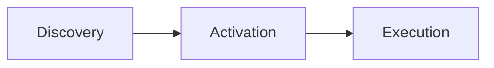

# Antigravity Skills: The Complete Guide to AI Agent Skills

Welcome to the ultimate guide for **Antigravity Skills** — the open-format standard for extending AI Agent capabilities with specialized expertise and workflows.

> **What you'll learn**: How to create professional Agent Skills, understand the SKILL.md specification, and leverage Antigravity Skills platform for maximum productivity.

---

## What Are Agent Skills?

**Agent Skills** are a lightweight, open format for giving AI agents new capabilities and domain expertise. Think of them as "plugins" that teach your AI assistant specialized knowledge and workflows.

### Key Characteristics

| Feature | Description |
|---------|-------------|
| **Self-documenting** | Skills are readable by both humans and agents — easy to audit and improve |
| **Extensible** | Start with simple text instructions, scale to executable code and templates |
| **Portable** | Skills are just files — easy to edit, version control, and share |

### What Can Skills Do?

| Capability | Description | Example |
|------------|-------------|---------|
| **Domain Expertise** | Package specialized knowledge as reusable instructions | Legal review workflows, data analysis pipelines |
| **New Abilities** | Give agents entirely new capabilities | Create presentations, build MCP servers, analyze datasets |
| **Repeatable Workflows** | Convert multi-step tasks into consistent, auditable processes | Code review, document generation |
| **Cross-Platform** | Reuse the same skill across different AI products | Works with Claude Code, Antigravity, and more |

---

## How Agent Skills Work

Skills follow a three-phase workflow:



### Phase 1: Discovery

At startup, the agent loads only the `name` and `description` of each available skill — just enough to identify when a skill might be relevant.

### Phase 2: Activation

When a user's task matches a skill's description, the agent reads the full SKILL.md instructions into its context.

### Phase 3: Execution

The agent follows the instructions, loading referenced files or executing bundled scripts as needed.

> **Token Efficiency**: This progressive disclosure pattern optimizes token usage by loading content only when necessary.

---

## Directory Structure

### Minimal Structure

The simplest skill needs just one file:

```text
my-skill/
└── SKILL.md    # Required: Instructions + metadata
```

### Complete Structure

Complex skills can include optional directories:

```text
my-skill/
├── SKILL.md        # Required: Core definition file
├── scripts/        # Optional: Executable code
├── references/     # Optional: Documentation and references
└── assets/         # Optional: Templates and resources
```

### Directory Guidelines

| Directory | Purpose | Contents |
|-----------|---------|----------|
| `scripts/` | Executable code | Self-contained scripts with clear dependencies |
| `references/` | Technical docs | Detailed references, schemas, domain-specific guides |
| `assets/` | Resources | Templates, images, data files |

> [!IMPORTANT]
> **Forbidden Files**: Never include `README.md`, `CHANGELOG.md`, or `INSTALLATION.md` in skills. These are for humans, not agents — they waste tokens.

---

## SKILL.md File Format

Every skill requires a `SKILL.md` file with two parts:

1. **YAML Frontmatter** (required) — Metadata
2. **Markdown Body** — Detailed instructions

### Frontmatter Specification

```yaml
---
name: skill-name
description: A description of what this skill does and when to use it.
license: Apache-2.0                    # Optional
compatibility: Requires Python 3.10+   # Optional
metadata:                              # Optional
  author: your-name
  version: "1.0"
---
```

### Required Fields

| Field | Format | Rules |
|-------|--------|-------|
| `name` | 1-64 chars | Lowercase letters and hyphens only. Must match directory name. |
| `description` | 1-1024 chars | Describe what the skill does AND when to use it. Include trigger keywords. |

### Name Field Rules

✅ **Valid names:**
```yaml
name: pdf-processing
name: code-review
name: data-analysis
```

❌ **Invalid names:**
```yaml
name: PDF-Processing   # No uppercase
name: -pdf             # Can't start with hyphen
name: pdf--processing  # No consecutive hyphens
```

### Description Best Practices

The `description` field is critical — it determines when agents activate your skill.

✅ **Good description:**
```yaml
description: Extracts text and tables from PDF files, fills PDF forms, and merges multiple PDFs. Use when working with PDF documents or when the user mentions PDFs, forms, or document extraction.
```

❌ **Poor description:**
```yaml
description: Helps with PDFs.  # Too vague, missing keywords
```

---

## Body Content Guidelines

The markdown body is your operational guide for the agent. Include:

| Section | Purpose |
|---------|---------|
| **Step-by-step instructions** | Clear execution steps |
| **Input/Output examples** | Help agent understand expectations |
| **Edge cases** | Handle exceptions gracefully |
| **Role/Expectations** | Define agent's role when using this skill |
| **Checklists** | Step-by-step verification items |
| **Protocols** | Output formats (e.g., "Always return JSON") |

### Example: Code Review Skill

```markdown
---
name: code-review
description: Review code changes for bugs, style issues, and best practices. Use when handling PRs or checking code quality.
---

# Code Review Skill

When performing code reviews, follow these steps:

## 1. Review Checklist

- **Correctness**: Does the code implement intended functionality?
- **Edge Cases**: Are error conditions and exceptions handled?
- **Style**: Does it follow project naming and structure conventions?
- **Performance**: Any obvious inefficiencies or resource leaks?

## 2. Providing Feedback

- Point to specific line numbers for improvements
- Explain "why to change", not just "what to change"
- Provide refactored code examples when possible
```

---

## Token Optimization

Antigravity Skills are designed for token efficiency:

| Level | Budget | When Loaded | Content |
|-------|--------|-------------|---------|
| **Metadata** | ~100 tokens | At startup | `name` and `description` only |
| **Instructions** | &lt;500 lines | On activation | Full SKILL.md body |
| **Resources** | On-demand | When needed | Files in `scripts/`, `references/`, `assets/` |

> [!CAUTION]
> **Hard Limit**: SKILL.md body must be under **500 lines**. Split longer content into `references/` directory.

### Optimization Tips

1. **Black-box scripts**: Instruct agents to use `--help` instead of reading script source code
2. **Progressive loading**: Put detailed documentation in `references/` for on-demand access
3. **Modular design**: Create focused, single-purpose skills instead of monolithic ones

---

## Degrees of Freedom

Choose the right implementation approach based on task characteristics:

| Level | Use Case | Implementation |
|-------|----------|----------------|
| **High Freedom** | Creative tasks, exploration | Pure text instructions |
| **Medium Freedom** | Best practices with flexibility | Pseudocode / Templates |
| **Low Freedom** | Error-prone, deterministic tasks | Scripts (Python/Bash) |

**Examples:**
- 🎨 **High**: Web design, creative writing, brainstorming
- 📝 **Medium**: Code review, commit message generation
- 🔧 **Low**: PDF rotation, format conversion, calculations

---

## Antigravity Skills Platform Integration

### Storage Locations

| Type | Path | Scope |
|------|------|-------|
| **Project Skills** | `<workspace-root>/.agent/skills/` | Current project only |
| **Global Skills** | `~/.gemini/antigravity/skills/` | Available across all projects |

### File Naming

Antigravity supports two patterns:

| Pattern | Example | Use Case |
|---------|---------|----------|
| **Single file** | `skill-name.md` | Simple skills |
| **Directory** | `skill-name/SKILL.md` | Complex skills with resources |

### Activation Mechanism

Skills are activated through **semantic matching**. The agent:
1. Scans available skill descriptions
2. Matches descriptions to user tasks
3. Autonomously activates relevant skills

---

## Security Considerations

When integrating skills, implement these safeguards:

| Measure | Description |
|---------|-------------|
| **Sandboxing** | Run scripts in isolated environments |
| **Allowlisting** | Execute only scripts from trusted skills |
| **Confirmation** | Prompt users before dangerous operations |
| **Logging** | Record all script executions for audit |

---

## Validation Tools

Use the official `skills-ref` tool to validate skills:

```bash
# Validate a skill
skills-ref validate ./my-skill

# Generate prompt XML
skills-ref to-prompt <path>...
```

---

## Best Practices Summary

| Practice | Benefit |
|----------|---------|
| **Precise descriptions** | Better activation matching |
| **Modular design** | Single-purpose skills are easier to maintain |
| **Include decision trees** | Clear logic for complex scenarios |
| **Control token budget** | Keep SKILL.md under 500 lines |
| **Use references folder** | Store detailed docs separately |

---

## Official Resources

| Resource | Link |
|----------|------|
| Agent Skills Specification | [agentskills.io](https://agentskills.io/) |
| Specification Repository | [GitHub](https://github.com/agentskills/agentskills) |
| Example Skills | [Anthropic Skills](https://github.com/anthropics/skills) |
| Best Practices Guide | [Claude Platform](https://platform.claude.com/docs/en/agents-and-tools/agent-skills/best-practices) |

---

## Next Steps

Ready to create your first Antigravity Skill? 

1. **Start simple** — Create a minimal SKILL.md with just name and description
2. **Test iteratively** — Refine your skill based on agent behavior
3. **Share with the community** — Publish to the [Antigravity Skills Marketplace](/skills)

---

*Have questions? Join our [community discussion](https://github.com/anthropics/skills/discussions) or contact [support@antigravityskills.com](mailto:support@antigravityskills.com)*
